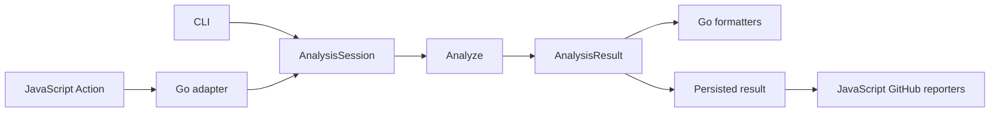

# GitHub Action migration plan

## Purpose and scope

actionlint checks GitHub Actions workflow files and delegates embedded shell and Python scripts to ShellCheck and Pyflakes. Its GitHub Action previously ran inside a Docker container. This migration runs the Action as JavaScript on the runner, installs native tools, and uses the ordinary actionlint binary for analysis. The goals are cross-platform execution, visible configuration selection, configuration through Action inputs, and tools that remain available to subsequent workflow steps.

The next phase separates analysis from reporting so one check can produce console output, annotations, a job summary, and optional pull-request suggestions. It reuses the CLI's analysis engine and diagnostic model.

## Implementation status

The JavaScript launcher and release builder originate in kjanat/actionlint@99f403e5. The shared CLI analysis architecture was merged in kjanat/actionlint#155 as kjanat/actionlint@6095acca72b083a6f3e200fc89930ca39c922026. This branch integrates master through kjanat/actionlint@010e812f.

The Action adapter now invokes `AnalysisSession` directly, then renders the result. Configuration overlays and source reporting belong to the shared session; the compatibility `Linter` forwards its options there. Configuration files retain the YAML document from the same parse used to resolve their values and origins. Tool paths, argument arrays, and child working directories use `ExternalCommandOptions`. The Action timeout returns at its deadline and cancels analysis, including external processes. Analysis owns its buffers and uses explicit paths. A timeout returns a separate result while analysis finishes; the process working directory stays unchanged.

Selected-configuration reports include a `ConfigInspection` with effective values and per-setting file/default/Action-input origins. Input origins retain the input name and line/column within its value. Explicit null resets remain attributable when a later input supplies only part of the reset mapping.

Existing Action output formats still use the compatibility renderer after analysis. The versioned persisted Action envelope, additional reporters, and mapped fixes remain pending.

Local validation covers the Action adapter package, configuration/overlay and selected-input regressions, representative modern/legacy CLI paths, JavaScript type checking, and Windows child-environment execution. Cross-platform consumer execution and release distribution still require CI validation. Implementation does not imply publication.

## Review stack

The implementation is split into four dependent branches, ordered from `master`:

1. `stack/action-shellcheck`: shared configuration overlays and provenance, typed ShellCheck configuration, shell and path resolution.
2. `stack/action-executable-bit`: Git-index executable-bit checking for referenced workflow scripts.
3. `stack/action-composite-scripts`: script checks in referenced local composite actions, including nested actions.
4. `stack/action-javascript`: Node launcher, shared Go adapter, Action inputs, release packaging and consumer tests.

Repository-reference cleanup and JavaScript-tooling changes are separate maintenance branches. The original `feat/javascript-action` branch preserves the implementation history; these review branches do not rewrite it.

## Compatibility contract

- Preserve existing Action inputs and the outputs `exit-code`, `result`, `problems-found`, `problem-count`, `output`, and `output-file`.
- Preserve the existing representations selected by `format`; a new internal diagnostic schema must not silently change the public JSON output.
- Preserve exit codes: 0 for a clean check, 1 for findings, 2 for invalid inputs, and 3 for execution failure. `fail-on-error: false` permits findings without failing the step; invalid inputs and execution failures still fail.
- Keep configuration precedence and empty-value behavior explicit. Changes to ShellCheck configuration discovery must account for existing workflows that currently run with discovery disabled.
- The source checkout contains no generated `dist` directory. Consumers use published Action artifact refs, which contain the bundle required by `action.yml`.
- Installing the Action never reuses a cached actionlint binary. Optional external-tool caching is separate from this constraint.

## Implemented JavaScript Action baseline

### Distribution and entry points

- The GitHub Action is a JavaScript action running on Node 24, bundled with tsdown.
- The ordinary actionlint Go binary serves both the CLI and the action adapter (`-github-action`), including Docker use.
- Generated JavaScript release files stay outside the source checkout.
- The private workspace package is named `actionlint-action`; it has no separately maintained release version.
- The release/tag version passes through the release builder into tsdown's compile-time version stamp. Local builds fall back to `git describe --tags --abbrev=0 --match 'v[0-9]*.[0-9]*.[0-9]*'`, stripping the leading `v`.
- Git supplies the version fallback during the release build. An explicit release version takes precedence.
- Release packaging uses source `vX.Y.Z` tags and separate `action-vX.Y.Z` artifact tags, plus moving action tags. Compatibility with the signed-release workflow remains an open decision.

### Dependencies and tools

- Use native Node APIs for execution, downloads and GitHub environment files.
- Use native package.json imports such as `#assets` and `#tools/shellcheck`, with separate `import type` declarations.
- ShellCheck release assets and SHA-256 digests come from imported upstream release JSON. The update script fetches the latest release.
- Pyflakes metadata comes from PyPI JSON. Its historical `releases` object is excluded; current release metadata and downloads remain. Update scripts exist for both tools.
- Python launcher source is a real `.py` file embedded by tsdown. The wheel launcher runs Python in isolated mode (`-I`).
- The action and actionlint binary are never cached or reused between invocations. Each normal invocation downloads and verifies actionlint again.
- Optional external tools can use existing installations or the runner tool cache.
- Before installing tools, the launcher asks the Go adapter to resolve file configuration and Action overlays. `tools.shellcheck.enabled: false` skips ShellCheck provisioning and PATH export for inputs using that configuration.
- ZIP extraction on Windows prefers `pwsh.exe`, falling back to `powershell.exe`. It uses .NET ZIP extraction with archive/destination in child-only environment variables. Unix ZIP uses unzip; tar.gz uses tar.

### Configuration UX

- Discover both `.github/actionlint.yaml` and `.github/actionlint.yml`; `.yaml` wins when both exist.
- Show the selected configuration file and applied input overlays.
- Whole-config input `config` accepts YAML or JSON, including values produced by GitHub's `toJSON` expression.
- Configuration sections are also action inputs: self-hosted-runner, config-variables, config-secrets, paths, assume-default-permissions, policy.
- Precedence: section inputs > whole `config` input > selected config file > defaults.
- Maps merge; lists and scalars replace. Blank inputs inherit, empty maps retain inherited entries, empty lists clear lists, and null resets the corresponding value.
- Warn when literal outer quotes in an ignore regex prevent it from matching a diagnostic.

### Commands in subsequent steps

Three independent inputs default to true:

- `add-actionlint-to-path`
- `add-shellcheck-to-path`
- `add-pyflakes-to-path`

A PATH opt-out does not disable linting. `shellcheck: false` or `pyflakes: false` skips provisioning and exporting that tool. Setting all three PATH inputs to false writes nothing to GITHUB_PATH.

Exported actionlint is copied into a fresh per-invocation RUNNER_TEMP directory and remains available until job cleanup. Download/extraction scratch files are cleaned after the action step. Exported wheel-based pyflakes gets the necessary POSIX/Windows command wrappers. Fresh command directories take precedence over earlier PATH entries; shell aliases and platform-specific current-directory lookup are separate resolution rules.

PATH export does not itself register problem matchers.

Windows environment variable names are case-insensitive. The launcher normalizes Windows environment keys before reading inputs, clearing inherited tool overrides, and constructing child environments; Unix keeps case-sensitive keys. Child environments contain one spelling of PATH. PATH controls directory search; PATHEXT controls executable extensions for Windows command resolution. The current tool lookup supports only `.exe`; broader support also requires explicit handling of `.cmd`/`.bat` launchers, which cannot be spawned directly with `shell: false`.

## Shared analysis integration

### Shared APIs and ownership

The CLI refactor separates source/configuration resolution (`AnalysisSession`), checking (`Analyze`), results (`AnalysisResult`), and presentation (`AnalysisRenderer`). Its `Diagnostic` type carries rule identity, message, path, snippet, and start/end positions. Positions use one-based Unicode character columns and exclusive range ends. Its JSON `CheckResult` includes a `schema_version`.

| Component           | Responsibility                                                                                                                           |
| ------------------- | ---------------------------------------------------------------------------------------------------------------------------------------- |
| JavaScript Action   | Install tools, export PATH, manage Action lifecycle and result files, emit annotations and summaries, publish explicitly enabled reviews |
| Go Action adapter   | Translate Action inputs into shared analysis options; preserve the public Action output and exit-status contract                         |
| Shared Go analysis  | Discover sources, resolve configuration and overlays, invoke external linters, produce diagnostics and mapped fixes                      |
| Shared Go renderers | Produce text, JSON/JSONL, SARIF, and supported legacy template output from one analysis result                                           |

The normal Go binary remains the entry point for CLI and Action operation. Its CLI route uses `internal/cli.Command` and retains explicit Action dispatch. Keep one shared version API and release stamp.

### Integration work

- Implemented: the merged CLI frontend and Action dispatch share the ordinary binary and version API.
- Implemented: config overlays and selected-source callbacks run in `AnalysisSession`; `Linter` remains a compatibility facade. The canonical effective-config serializer includes configuration fields automatically.
- Implemented: the Action adapter analyzes through `AnalysisSession`, passes its cancellation context through analysis, and renders afterward. Legacy Action JSON and SARIF representations remain compatible.
- Implemented: provisioned tool paths and Python's `-I`/launcher arguments use `ExternalCommandOptions` without shell-word quoting.
- Implemented: selected-configuration reports expose `ConfigInspection` with per-setting Action-input provenance. File and overlay values resolve from retained YAML nodes, preserving original locations and null/empty semantics. `.yaml`/`.yml` discovery and explicit-file selection retain their existing regression coverage.

The refactor's CLI already accepts tool settings through `ACTIONLINT_{SHELLCHECK,PYFLAKES}_{BIN,FLAGS,ENV}`. The Action should translate its inputs into the same typed options; it should not depend on parsing CLI help or duplicating CLI argument grammar.

Multiple `AnalysisRenderer` instances can consume one in-memory `AnalysisResult`. The refactor's CLI still selects one output format and destination per invocation; configurable multi-output dispatch remains work to implement.

### Serialization boundary

The refactor's JSON `CheckResult` is a starting schema. A persisted analysis result also needs the private source and rule metadata that `AnalysisResult` retains for renderers, including SARIF. Deserializing `CheckResult` alone does not reconstruct that state.

Define a versioned Action result envelope around the shared diagnostic model. It must retain the outcome, configuration reports, hints, counts, and data needed by deferred reporters. Keep general-purpose rendering in Go. For deferred SARIF output, either persist the Go-rendered report alongside diagnostics or extend the persisted schema with the metadata its renderer needs; that storage choice remains open.

## Implemented: external linter configuration

The shared run-directory resolver also supports the independent `executable-bit`
rule from kjanat/actionlint#68. It checks direct literal script calls against a
per-analysis Git index snapshot, including on Windows hosts. Known self checkout
paths and literal `cd` are resolved; earlier `chmod` invalidates affected modes.
Opaque actions/commands, dynamic/control-flow cases and concurrent execution
invalidate certainty. Git index paths are tracked as consumed inputs. This rule
does not depend on ShellCheck and does not execute workflow scripts.

Referenced local composite actions now feed their run steps into ShellCheck,
Pyflakes and executable-bit checking, including nested local calls. Diagnostics
retain metadata source locations and path-specific ignores. Composite scripts
do not inherit workflow/job run defaults; checkout and permission state follow
the caller. Cycles and unknown execution paths remain conservative.

Shared configuration exposes `tools.shellcheck.enabled` (default true), boolean
`tools.shellcheck` shorthand, and `tools.shellcheck.config` as an inline mapping
or rc file/directory path. Both CLI and Action apply it through the
shared engine. The `tools` Action input uses normal config overlays and provenance.
Native directives are supplied to each script without temporary configuration
files; diagnostic positions account for the added lines. Supported settings are
disable, enable, shell, extended-analysis, external-sources and source-path.
The contract is tested with ShellCheck 0.11.0; new upstream settings need schema
and runtime support, while installed binaries remain selectable independently.
The root schema references `schemas/shellcheck/0.11.0.schema.json`. Future versions
get separate snapshots; normal generation preserves published versions. The npm
package includes these files; editors may fetch the referenced URLs.

Config paths default to the directory containing the selected actionlint config
file (`${{ configdir }}`); `${{ gitdir }}` selects the workflow repository root. Directory
selection checks `.shellcheckrc` before `shellcheckrc`. Relative source paths use
each run step's effective working directory, with step/job/workflow precedence.
Unresolved or locally unavailable working directories retain script checking but
disable source following. Explicit rc files enter the consumed-input set.
`${{ github.workspace }}` uses the runtime workspace when available, otherwise
the local repository root. `${{ github.action_path }}` resolves per analyzed
composite action, including nested calls; an unrelated ambient action directory
is ignored. These interpolations also work in inline `source-path` entries.

### Input contract

- `shellcheck-config`: true, false, or a file path relative to GITHUB_WORKSPACE.
  - true: discover ShellCheck configuration.
  - false: disable configuration discovery.
  - path: use that explicit workspace-relative configuration file.
- `shellcheck-args`: a YAML/JSON array of argument strings, passed as argv without invoking a shell.

Discovery defaults to false to preserve existing Action behavior. When enabled,
ShellCheck searches from `working-directory` (scripts arrive on stdin), including
parent and user config locations. Explicit config paths resolve against
GITHUB_WORKSPACE and must identify readable files within the workspace.

### Invocation and precedence

The shared analysis API accepts optional `ShellcheckSettings`: nil `Config` inherits
project selection, `ShellcheckRCDisabled` disables rc loading,
`ShellcheckRCDiscover` enables discovery, and `ShellcheckRCFile` selects `--rcfile`.
Without a selection, `--norc` remains the default.
ShellCheck supports both `.shellcheckrc` and `shellcheckrc`.

The CLI retains its existing command-line and typed executable/argv/environment
options. The Action validates `shellcheck-args` and inherited SHELLCHECK_OPTS,
merging inherited arguments before explicit input arguments. Child-only
environment overrides clear SHELLCHECK_OPTS to avoid applying it twice.

Explicit single-value flags override inherited values; additive checking options
accumulate with duplicates removed. An explicit shellcheck-config input overrides
config flags. Output flags normalize to JSON1 for transport; early-exit flags and
additional source files are rejected. Invalid inputs return exit status 2 before analysis.

Shell resolution handles container defaults, known literal expressions and unknown
overrides, preserving explicit step/job/workflow precedence. Startup options
distinguish implicit Bash, explicit Bash and custom templates. The analyzer cannot
discover which executables are installed on a remote runner.

Pyflakes has almost no configurable checking flags. An args input cannot add support for rule selection, ignore configuration or autofixes. Replacing the Python backend remains a separate decision; no replacement has been selected.

## Planned: structured results and multiple reporters

### Action baseline

- The Go action adapter normally obtains diagnostics as JSON; SARIF currently has a special rendering path.
- One selected format produces one rendered string. Console output, action `output`, and optional `output-file` receive that same representation.
- `format: github` emits workflow annotation commands directly from Go. Other ordinary output formats do not independently emit per-diagnostic annotations.
- The Action adapter uses the shared analysis session and renders the completed result through the compatibility renderer. Its public JSON array remains unchanged; the persisted Action envelope is a separate planned boundary.

### Reporter design

Lint once into the shared `AnalysisResult`. Render general-purpose formats in Go and let JavaScript reporters consume persisted diagnostics for GitHub-specific presentation:

- GitHub annotations
- Markdown job summary
- JSON/SARIF or other result files produced by the shared Go renderers
- Optional PR review with suggested fixes

The persisted result needs the lint outcome/exit status, diagnostics with source locations and snippets, configuration reports, hints, and selected rendered reports or the metadata needed to generate them. It must also represent invalid inputs and fatal failures. Distinguish an incomplete or missing result file from a successful check with no findings.

Use a stable filename such as diagnostics.json inside a unique RUNNER_TEMP directory for each action invocation. Do not share one global temporary filename between action instances.

Preserve existing format/output/output-file semantics as the primary representation. Additional reporters run independently from that representation and must not rerun the linter. Avoid duplicate annotations when github is also the primary format. Keep lint exit status and fail-on-error behavior independent from presentation.

### Reporting lifecycle

Recommended baseline: the JS main invocation reads the structured result immediately after the Go process exits, emits reports, and then completes with the appropriate status.

A GitHub `runs.post` hook executes after the job's steps finish. It is useful if results from later command invocations must be collected. That design additionally needs an explicit collection contract for those invocations, a persistent result file, a path passed through GITHUB_STATE, and cleanup after reporting. Exporting commands to PATH alone does not collect their diagnostics.

Final choice between immediate reporting and end-of-job collection remains open.

### Presentation capabilities

- Annotations: title, severity, source location, and plain/multiline text. Do not rely on rich Markdown in annotation messages.
- Job summaries: GitHub-flavored Markdown, including tables, links, code and diff blocks.
- Suggestions users can apply: inline PR review comments containing suggestion blocks. Markdown diffs in summaries provide previews; GitHub's apply control requires an inline suggestion.

## Planned: structured fixes and PR reviews

### Current gap

The Action baseline's error model has message, location, kind, snippet and end column. The CLI refactor adds a shared diagnostic model with explicit source ranges. Neither model currently carries structured fixes or diagnostic severity, and the SARIF template has no fixes.

ShellCheck's JSON1 output contains `fix.replacements` with ranges, replacement text, insertion ordering and precedence. The current decoder discards those fields. Retain them from the existing ShellCheck invocation.

### Required fix model and mapping

Model fixes as a description plus one or more file/range/replacement edits. Retain source, rule identity, and severity as structured fields throughout analysis and reporting.

Translate ShellCheck edits back to the original workflow source. Account for the injected shell setup line, sanitized GitHub expressions, YAML indentation, quoting and folded scalars. Do not suggest edits to placeholder text or to a range that cannot be mapped reliably. Combine compatible edits for the same source range; unresolved conflicts must not become suggestions users can blindly apply.

A reporter can derive before/after snippets, unified patches, SARIF fixes and PR suggestions from that shared edit model.

### Review reporter

Create one review with multiple inline comments. Each comment targets the correct file/range at the reviewed PR commit and can contain a suggestion block followed by the relevant ShellCheck codes and explanations. Group related diagnostics into a coherent replacement where appropriate.

Feed structured diagnostics and fixes directly to the review reporter. Findings without a reliable fix remain explanatory diagnostics. Only locations supported by the PR diff can become inline suggestions; other findings remain available in annotations/summary.

Review publication must be explicitly enabled and requires an appropriate token with pull-requests: write. Read-only/fork workflows must retain useful annotation/summary reporting. Rerun deduplication/update behavior still needs design.

## Delivery order and acceptance criteria

Shared analysis, overlay provenance, typed tool invocation, cancellation, and ShellCheck inputs are implemented. The persisted protocol and reporting work in items 4 through 6 remain pending. Item 7 has Windows environment normalization and execution coverage; PATHEXT and batch launchers remain unfinished. Item 8 has a release builder and consumer tests, while artifact signing and moving-ref integration remain open. Validate affected behavior with focused checks and run platform-specific integration checks in CI.

1. **Integrate the shared analysis core.** CLI and Action use the same analysis implementation; existing rules and policy fields remain available. Overlay tests cover precedence, null/empty values, explicit config selection, and both config extensions. A timeout cancels outstanding external linter processes.
2. **Adapt the Action protocol.** The adapter uses shared diagnostics and literal tool arguments. Existing output names, public formats, exit codes, and `fail-on-error` behavior remain compatible, including invalid-input and failure cases.
3. **Add ShellCheck configuration inputs.** Discovery, disabled discovery, and an explicit workspace-relative path each select the intended config. Argument boundaries survive spaces and quotes; protocol-changing flags cannot corrupt JSON1 decoding. Document the selected default, discovery root, and argument/config precedence.
4. **Persist results and dispatch reporters.** One analysis produces all selected outputs. Round-trip checks preserve Unicode and multiline locations, findings, and required metadata. Repeated Action instances use distinct files; annotations appear once; zero findings and incomplete results are distinguishable. Verify cleanup and the chosen immediate/post lifecycle.
5. **Preserve and map fixes.** ShellCheck replacements map to the original YAML source, including expression placeholders and scalar indentation/encoding. Fixtures verify the resulting workflow text. Unmappable or conflicting edits remain diagnostics without an applicable suggestion.
6. **Add opt-in PR reviews.** Suggestions target the reviewed commit and valid diff ranges, related findings are grouped, reruns follow a documented deduplication policy, and missing write permissions retain annotation/summary output.
7. **Complete Windows tool resolution.** PATH/PATHEXT discovery and supported launcher types work with case-insensitive environment names. Next-step tests exercise exported actionlint, ShellCheck, and Pyflakes with spaced paths and preserved arguments. Each PATH opt-out is independent.
8. **Validate release distribution.** Build with an explicit release version and with the Git-tag fallback. Verify standalone bundles, checksums, source/artifact tag relationships, and signed-tag requirements. A clean consumer job runs the artifact without building JavaScript or Docker. The source checkout remains free of generated bundles, and actionlint is downloaded afresh per invocation.

The existing focused checks in [the Action package](packages/github-action/tests), [Go adapter](internal/githubaction), [config overlay tests](config_overlay_test.go), and [release builder tests](scripts/build-action-release.test.mjs) provide the baseline. CI should exercise Linux, macOS, and Windows consumer runs. Windows resolution and release-distribution work can proceed alongside shared-core integration; reporters depend on that integration, and review suggestions depend on mapped fixes.

## Open decisions

- Reporter-selection inputs and defaults; immediate reporting, end-of-job collection, or both.
- Persisted result schema and versioning; pre-rendered SARIF versus sufficient metadata for deferred rendering.
- Severity mapping and its effect on annotations and the existing failure contract.
- PR review deduplication/update behavior on reruns and new commits.
- Final source/artifact tag names, moving refs, and signing strategy.
- Whether to replace the Python backend; no replacement is selected by this migration plan.
